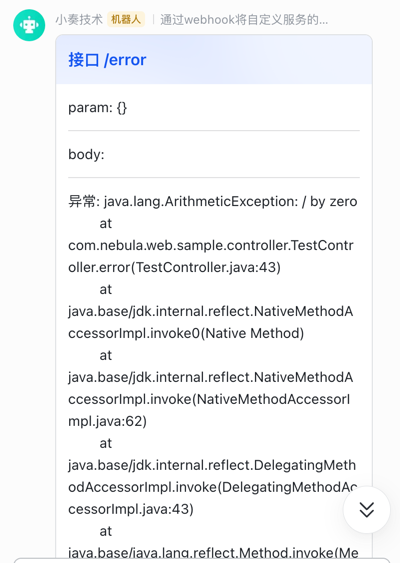

# spring-boot-nebula

开箱即用的 Spring Boot 基础组件库，统一依赖版本、简化 Web 开发、封装常用中间件能力。

| 项目 | 说明 |
|------|------|
| 当前版本 | `3.0.3` |
| Java | 17+ |
| Spring Boot | 3.4.x（由 BOM 统一管理） |
| GroupId | `io.github.weihubeats` |
| 示例模块 | [spring-boot-nebula-samples](spring-boot-nebula-samples) |
| 在线文档 | [deepwiki-spring-boot-nebula](https://deepwiki.com/weihubeats/spring-boot-nebula) |

> **版本说明**：`3.x` 对应 Spring Boot 3 + Java 17；若项目仍使用 Spring Boot 2，请选用 `0.0.x` 系列版本。

---

## 目录

- [快速开始](#快速开始)
- [核心能力](#核心能力)
- [模块一览](#模块一览)
- [spring-boot-nebula-dependencies](#spring-boot-nebula-dependencies)
- [spring-boot-nebula-web](#spring-boot-nebula-web)
- [spring-boot-nebula-mybatis](#spring-boot-nebula-mybatis)
- [spring-boot-nebula-dynamic-datasource](#spring-boot-nebula-dynamic-datasource)
- [spring-boot-nebula-distribute-lock](#spring-boot-nebula-distribute-lock)
- [spring-boot-nebula-excel](#spring-boot-nebula-excel)
- [spring-boot-nebula-join](#spring-boot-nebula-join)
- [spring-boot-nebula-feign](#spring-boot-nebula-feign)
- [spring-boot-nebula-aggregate](#spring-boot-nebula-aggregate)
- [spring-boot-nebula-all](#spring-boot-nebula-all)
- [示例模块](#示例模块)
- [最佳实践](#最佳实践)

---

## 快速开始

### 1. 引入 BOM（推荐）

在父 POM 中统一版本，避免各项目依赖版本不一致（如 Redisson 3.14 vs 3.61 导致行为差异）：

```xml
<dependencyManagement>
    <dependencies>
        <dependency>
            <groupId>io.github.weihubeats</groupId>
            <artifactId>spring-boot-nebula-dependencies</artifactId>
            <version>3.0.3</version>
            <type>pom</type>
            <scope>import</scope>
        </dependency>
    </dependencies>
</dependencyManagement>
```

### 2. 引入 Web 模块

```xml
<dependency>
    <groupId>io.github.weihubeats</groupId>
    <artifactId>spring-boot-nebula-web</artifactId>
</dependency>
```

### 3. 编写启动类

```java
@SpringBootApplication
public class WebApplication {

    public static void main(String[] args) {
        TimeZone.setDefault(TimeZone.getTimeZone("Asia/Shanghai"));
        SpringApplication.run(WebApplication.class, args);
    }
}
```

### 4. 编写接口

无需手动包装 `Response`，在 Controller 方法上添加 `@NebulaResponseBody` 即可：

```java
@GetMapping("/test")
@NebulaResponseBody
public String test() {
    return "小奏";
}
```

响应格式：

```json
{
  "code": 200,
  "data": "小奏",
  "msg": "success"
}
```

---

## 核心能力

| 能力 | 说明 |
|------|------|
| 统一依赖管理 | 通过 BOM 锁定 Spring Boot、MyBatis-Plus、Redisson 等版本 |
| Web 响应封装 | `@NebulaResponseBody` 自动包装统一 JSON 结构 |
| 统一异常处理 | 全局异常拦截，支持飞书 Webhook 告警 |
| 分页对象 | `NebulaPageQuery` / `NebulaPageRes` 开箱即用 |
| 时间戳解析 | `@GetTimestamp` 自动将时间戳参数转为 `LocalDateTime` |
| 分布式锁 | `@NebulaDistributedLock` 基于 Redisson |
| MyBatis-Plus | `BaseDO`、类型处理器、分页工具 |
| 读写分离 | `@NebulaRead` / `@NebulaWrite` 动态数据源切换 |
| 区域路由 JOIN | `@AutoJoin` 自动拼接区域路由表 |
| Excel | 基于 FastExcel 的导入导出工具 |
| DDD 聚合根 | 聚合变更追踪与 Diff 对比 |
| 健康探针 | 内置 `spring-boot-starter-actuator` |

---

## 模块一览

| 模块 | ArtifactId | 说明 |
|------|------------|------|
| [spring-boot-nebula-dependencies](spring-boot-nebula-dependencies) | `spring-boot-nebula-dependencies` | 统一依赖 BOM |
| [spring-boot-nebula-common](spring-boot-nebula-common) | `spring-boot-nebula-common` | 基础工具与分页模型 |
| [spring-boot-nebula-web-common](spring-boot-nebula-web-common) | `spring-boot-nebula-web-common` | Web 工具类（Bean 获取、EL 解析等） |
| [spring-boot-nebula-alert](spring-boot-nebula-alert) | `spring-boot-nebula-alert` | 告警模块（飞书等） |
| [spring-boot-nebula-web](spring-boot-nebula-web) | `spring-boot-nebula-web` | Web 封装（响应、异常、告警） |
| [spring-boot-nebula-mybatis](spring-boot-nebula-mybatis) | `spring-boot-nebula-mybatis` | MyBatis-Plus 封装 |
| [spring-boot-nebula-dynamic-datasource](spring-boot-nebula-dynamic-datasource) | `spring-boot-nebula-dynamic-datasource` | 动态数据源（读写分离） |
| [spring-boot-nebula-distribute-lock](spring-boot-nebula-distribute-lock) | `spring-boot-nebula-distribute-lock` | 分布式锁 |
| [spring-boot-nebula-excel](spring-boot-nebula-excel) | `spring-boot-nebula-excel` | Excel 导入导出 |
| [spring-boot-nebula-join](spring-boot-nebula-join) | `spring-boot-nebula-join` | 区域路由 SQL 自动 JOIN |
| [spring-boot-nebula-feign](spring-boot-nebula-feign) | `spring-boot-nebula-feign` | OpenFeign 自动解包 NebulaResponse |
| [spring-boot-nebula-aggregate](spring-boot-nebula-aggregate) | `spring-boot-nebula-aggregate` | DDD 聚合根 |
| [spring-boot-nebula-aop-base](spring-boot-nebula-aop-base) | `spring-boot-nebula-aop-base` | AOP 基础能力 |
| [spring-boot-nebula-all](spring-boot-nebula-all) | `spring-boot-nebula-all` | 聚合常用模块的一站式依赖 |
| [spring-boot-nebula-samples](spring-boot-nebula-samples) | — | 各模块使用示例 |

---

## spring-boot-nebula-dependencies

统一管理公司内所有 Spring Boot 项目的第三方依赖版本。应用项目只需在 `dependencyManagement` 中 import BOM，后续引入依赖时**无需再手动指定版本**。

```xml
<dependencyManagement>
    <dependencies>
        <dependency>
            <groupId>io.github.weihubeats</groupId>
            <artifactId>spring-boot-nebula-dependencies</artifactId>
            <version>3.0.3</version>
            <type>pom</type>
            <scope>import</scope>
        </dependency>
    </dependencies>
</dependencyManagement>
```

---

## spring-boot-nebula-web

### 引入依赖

```xml
<dependency>
    <groupId>io.github.weihubeats</groupId>
    <artifactId>spring-boot-nebula-web</artifactId>
    <version>3.0.3</version>
</dependency>
```

### 统一响应 `@NebulaResponseBody`

Controller 直接返回业务对象，由框架自动包装为统一 JSON：

```java
@GetMapping("/test")
@NebulaResponseBody
public String test() {
    return "小奏";
}
```

### Feign / RPC 调用

推荐引入 [spring-boot-nebula-feign](#spring-boot-nebula-feign)：Feign 方法直接声明业务返回类型，框架自动将 `NebulaResponse` 解包。

未引入该模块时，也可手动用 [NebulaResponse](spring-boot-nebula-web/src/main/java/com/nebula/web/boot/api/NebulaResponse.java) 接收，并通过 `data()` 取数（会校验状态码）。

### 响应码自定义

内部错误码仍为 `int`，仅影响对外 JSON 中的 `code` 字段：

```yaml
# 成功码写成字符串（兼容旧项目）
nebula.web.response-code: Success

# 成功/失败统一映射（推荐）
nebula.web.code-mapping:
  200: Success
  400: Failure
  500: Error
```

未配置时默认返回数字，例如 `"code": 200`。

### 分页对象

- 查询参数继承 [NebulaPageQuery](spring-boot-nebula-common/src/main/java/com/nebula/base/model/NebulaPageQuery.java)
- 返回结果使用 [NebulaPageRes](spring-boot-nebula-common/src/main/java/com/nebula/base/model/NebulaPageRes.java)

```java
@Data
public class StudentDTO extends NebulaPageQuery {
    private Long id;
    private String name;
    private Integer age;
}

@GetMapping("/list")
@NebulaResponseBody
public NebulaPageRes<StudentVO> list(StudentDTO studentDTO) {
    return studentService.list(studentDTO);
}
```

### 统一异常处理

参考 [NebulaRestExceptionHandler](spring-boot-nebula-web/src/main/java/com/nebula/web/boot/error/NebulaRestExceptionHandler.java)，对常见异常自动封装为统一响应格式。

开启飞书异常告警：

```yaml
nebula:
  web:
    monitor-open: true
    monitor:
      type: feishu
    monitor-url: https://open.feishu.cn/open-apis/bot/v2/hook/xxx
```

自定义告警实现 `NebulaErrorMonitor` 接口即可替换默认行为。



### 时间戳参数 `@GetTimestamp`

将请求中的时间戳自动解析为 `LocalDateTime`：

```java
@GetMapping("/test")
@NebulaResponseBody
public String test(@GetTimestamp LocalDateTime time) {
    return time.toString();
}
```

### 健康探针

模块已内置 `spring-boot-starter-actuator`，开启配置即可使用：

```yaml
management:
  endpoints:
    web:
      exposure:
        include: health,beans,trace
```

```http
GET http://localhost:8088/actuator/health
```

### 本地调试

1. 运行 [Application.java](spring-boot-nebula-samples/spring-boot-nebula-web-sample/src/main/java/com/nebula/web/sample/Application.java)
2. 执行 [http-test-controller.http](spring-boot-nebula-samples/spring-boot-nebula-web-sample/src/main/http/http-test-controller.http) 中的 `GET localhost:8088/test`

---

## spring-boot-nebula-mybatis

MyBatis-Plus 封装，提供基础实体、审计字段自动填充、类型处理器与分页工具。

### 引入依赖

```xml
<dependency>
    <groupId>io.github.weihubeats</groupId>
    <artifactId>spring-boot-nebula-mybatis</artifactId>
    <version>3.0.3</version>
</dependency>
```

### 主要能力

| 类 | 说明 |
|----|------|
| `BaseDO` | 基础实体（`id`、`createTime`、`updateTime`） |
| `NebulaMetaObjectHandler` | 插入/更新时自动填充审计字段 |
| `ArrayTypeHandler` / `ListTypeHandler` | 数组、列表类型处理器 |
| `PageHelperUtils` | 结合 `NebulaPageQuery` 的分页工具 |

### 分页示例

```java
Page<StudentDO> page = PageHelperUtils.startPage(dto);
List<StudentVO> list = ...;
return PageHelperUtils.of(list, page);
```

示例：[spring-boot-nebula-mybatis-sample](spring-boot-nebula-samples/spring-boot-nebula-mybatis-sample)

---

## spring-boot-nebula-dynamic-datasource

基于 `DynamicRoutingDataSource` 的读写分离，通过注解切换数据源。

### 引入依赖

```xml
<dependency>
    <groupId>io.github.weihubeats</groupId>
    <artifactId>spring-boot-nebula-dynamic-datasource</artifactId>
    <version>3.0.3</version>
</dependency>
```

### 注解

| 注解 | 说明 |
|------|------|
| `@NebulaRead` | 路由到读库 |
| `@NebulaWrite` | 路由到写库 |
| `@NebulaDS("dsName")` | 路由到指定数据源 |

```java
@NebulaWrite
public void saveTeacher(TeacherDTO dto) { ... }

@NebulaRead
public NebulaPageRes<TeacherVO> list(TeacherDTO dto) { ... }
```

### 配置示例

分别配置读写数据源，再注册到 `DynamicRoutingDataSource`：

```yaml
db:
  nebula:
    pg:
      write:
        driverClassName: org.postgresql.Driver
        url: jdbc:postgresql://localhost:5432/app_write
        username: user
        password: pass
      read:
        driverClassName: org.postgresql.Driver
        url: jdbc:postgresql://localhost:5432/app_read
        username: user
        password: pass
```

完整配置参考 [MybatisPlusConfig](spring-boot-nebula-samples/spring-boot-nebula-dynamic-datasource-sample/src/main/java/com/nebula/dynamic/datasource/sample/config/MybatisPlusConfig.java)。

示例：[spring-boot-nebula-dynamic-datasource-sample](spring-boot-nebula-samples/spring-boot-nebula-dynamic-datasource-sample)

---

## spring-boot-nebula-distribute-lock

基于 Redisson 的声明式分布式锁。

### 引入依赖

```xml
<dependency>
    <groupId>io.github.weihubeats</groupId>
    <artifactId>spring-boot-nebula-distribute-lock</artifactId>
    <version>3.0.3</version>
</dependency>
```

### 前置条件

需自行配置 `RedissonClient` Bean（参考示例中的 [RedissonConfig](spring-boot-nebula-samples/spring-boot-nebula-distribute-lock-sample/src/main/java/com/nebula/distribute/lock/sample/config/RedissonConfig.java)）。

### 使用方式

```java
@NebulaDistributedLock(lockNamePre = "order:updateOrder:", lockNamePost = "#dto.orderId")
public void updateOrder(OrderDTO dto) { ... }
```

| 属性 | 默认值 | 说明 |
|------|--------|------|
| `lockNamePre` | `""` | 锁名前缀 |
| `lockNamePost` | `""` | 锁名后缀，支持 SpEL |
| `tryLock` | `false` | 是否尝试加锁 |
| `tryWaitTime` | `30` | 尝试等待时间 |
| `outTime` | `20` | 锁超时自动释放时间 |
| `timeUnit` | `SECONDS` | 时间单位 |
| `fairLock` | `false` | 是否公平锁 |

示例：[spring-boot-nebula-distribute-lock-sample](spring-boot-nebula-samples/spring-boot-nebula-distribute-lock-sample)

---

## spring-boot-nebula-excel

基于 FastExcel 的 Excel 导入导出工具类封装。

### 引入依赖

```xml
<dependency>
    <groupId>io.github.weihubeats</groupId>
    <artifactId>spring-boot-nebula-excel</artifactId>
    <version>3.0.3</version>
</dependency>
```

### 导出示例

```java
@GetMapping("excel/export")
public void exportExcel(HttpServletResponse response) {
    ExcelUtils.export(response, "测试导出", dataList, XiaoZouVO.class);
}

@GetMapping("excel/export-with-date-suffix")
public void exportWithDateSuffix(HttpServletResponse response) {
    ExcelUtils.exportWithDateSuffix(response, "测试导出", dataList, XiaoZouVO.class);
}
```

`ExcelUtils` 同时支持多 Sheet 导出、模板填充、同步读取等，详见 [ExcelUtils](spring-boot-nebula-excel/src/main/java/com/nebula/excel/ExcelUtils.java)。

示例：[spring-boot-nebula-excel-sample](spring-boot-nebula-samples/spring-boot-nebula-excel-sample)

---

## spring-boot-nebula-join

多区域场景下，自动为 Mapper 查询拼接区域路由 JOIN 条件。

### 引入依赖

```xml
<dependency>
    <groupId>io.github.weihubeats</groupId>
    <artifactId>spring-boot-nebula-join</artifactId>
    <version>3.0.3</version>
</dependency>
```

### 配置

```yaml
region-route:
  enabled: true
  join-table: csa_user_route
  region-column-name: csa_region_id
  join-column: uid
  main-column: uid
  header-name: X-REGION
```

### 使用方式

在 Mapper 方法上标注 `@AutoJoin`，框架根据请求头 `X-REGION` 自动拼接 JOIN：

```java
@AutoJoin
List<UserDO> selectUsers();

@AutoJoin(mainColumn = "creating_uid")
List<OrderDO> selectOrders();

@AutoJoin(mainColumn = "merchant_code", joinTable = "csa_merchant_route", joinColumn = "m_id")
List<MerchantDO> selectMerchants();
```

示例：[spring-boot-nebula-join-sample](spring-boot-nebula-samples/spring-boot-nebula-join-sample)

---

## spring-boot-nebula-feign

OpenFeign 编解码扩展：自动将下游统一响应 `NebulaResponse<T>` 解包为业务对象 `T`。

```xml
<dependency>
    <groupId>io.github.weihubeats</groupId>
    <artifactId>spring-boot-nebula-feign</artifactId>
</dependency>
```

```java
@EnableFeignClients
@SpringBootApplication
public class Application { }

@FeignClient(name = "userClient", url = "${feign.client.user.url}")
public interface UserClient {

    // 直接返回业务对象，Decoder 自动解包 NebulaResponse
    @GetMapping("/provider/users/{id}")
    UserVO getUser(@PathVariable("id") Long id);

    // 显式声明 NebulaResponse 时不做解包
    @GetMapping("/provider/users/{id}")
    NebulaResponse<UserVO> getUserRaw(@PathVariable("id") Long id);
}
```

非成功码会走 `NebulaResponse#data()` 逻辑，抛出 `BizException` 或 `RpcException`。

HTTP 非 2xx 时由 `NebulaFeignErrorDecoder` 解析响应体中的 `NebulaResponse` 异常码，规则同上；无法解析则回退 Feign 默认行为。

默认开启统一 Feign 日志过滤器（请求 URL/参数体、响应状态/体、耗时），并支持慢调用告警：

```yaml
nebula:
  feign:
    log:
      enabled: true
      level: INFO                 # 普通请求日志级别
      slow:
        enabled: true
        threshold-millis: 3000    # 超过该毫秒数打慢调用告警，默认 3000（3 秒）
        level: ERROR              # 慢调用告警日志级别
```

日志示例：
- 普通：`Feign GET http://host/api?id=1 cost=12ms requestBody= responseStatus=200 responseBody={...}`
- 慢调用：`Feign slow call alert POST http://host/api cost=3201ms threshold=3000ms requestBody={...}`

示例：[spring-boot-nebula-feign-sample](spring-boot-nebula-samples/spring-boot-nebula-feign-sample)

---

## spring-boot-nebula-aggregate

DDD 聚合根支持，提供变更追踪（`AggregateDiff`）与旧对象快照（`@CreateOldObj`）。

### 引入依赖

```xml
<dependency>
    <groupId>io.github.weihubeats</groupId>
    <artifactId>spring-boot-nebula-aggregate</artifactId>
    <version>3.0.3</version>
</dependency>
```

聚合类继承 `AbstractAggregate<T>`，配合 `@AggregateCreate`、`@CreateOldObj` 使用。完整实践可参考 [ddd-example](https://github.com/weihubeats/ddd-example)。

---

## spring-boot-nebula-all

一站式引入常用模块（web + mybatis + distribute-lock + excel + dynamic-datasource），适合快速搭建新项目：

```xml
<dependency>
    <groupId>io.github.weihubeats</groupId>
    <artifactId>spring-boot-nebula-all</artifactId>
    <version>3.0.3</version>
</dependency>
```

---

## spring-boot-nebula-web-common

Web 层基础工具，被 `spring-boot-nebula-web` 间接依赖，也可单独使用：

| 工具类 | 说明 |
|--------|------|
| [SpringBeanUtils](spring-boot-nebula-web-common/src/main/java/com/nebula/web/common/utils/SpringBeanUtils.java) | 获取 Spring Bean |
| [NebulaSysWebUtils](spring-boot-nebula-web-common/src/main/java/com/nebula/web/common/utils/NebulaSysWebUtils.java) | 获取 Spring 环境信息 |
| [ExpressionUtil](spring-boot-nebula-web-common/src/main/java/com/nebula/web/common/utils/ExpressionUtil.java) | SpEL 表达式解析 |

---

## 示例模块

| 示例 | 对应能力 | 入口 |
|------|----------|------|
| [spring-boot-nebula-web-sample](spring-boot-nebula-samples/spring-boot-nebula-web-sample) | 统一响应、异常告警 | `Application.java` |
| [spring-boot-nebula-mybatis-sample](spring-boot-nebula-samples/spring-boot-nebula-mybatis-sample) | MyBatis-Plus 分页 | `StudentController` |
| [spring-boot-nebula-dynamic-datasource-sample](spring-boot-nebula-samples/spring-boot-nebula-dynamic-datasource-sample) | 读写分离 | `TeacherController` |
| [spring-boot-nebula-distribute-lock-sample](spring-boot-nebula-samples/spring-boot-nebula-distribute-lock-sample) | 分布式锁 | `TestService` |
| [spring-boot-nebula-excel-sample](spring-boot-nebula-samples/spring-boot-nebula-excel-sample) | Excel 导出 | `ExcelController` |
| [spring-boot-nebula-join-sample](spring-boot-nebula-samples/spring-boot-nebula-join-sample) | 区域路由 JOIN | `RegionInterceptorTest` |
| [spring-boot-nebula-feign-sample](spring-boot-nebula-samples/spring-boot-nebula-feign-sample) | Feign 自动解包 | `ConsumerController` |

本地运行示例：

```bash
cd spring-boot-nebula-samples/spring-boot-nebula-web-sample
mvn spring-boot:run
```

---

## 最佳实践

1. **优先使用 BOM**：在父 POM import `spring-boot-nebula-dependencies`，子模块不再手写版本号。
2. **按需引入**：不需要的能力不要引入 `spring-boot-nebula-all`，按模块拆分依赖更清晰。
3. **参考示例**：每个能力在 `spring-boot-nebula-samples` 下都有可运行的最小示例。
4. **DDD 实践**：[ddd-example](https://github.com/weihubeats/ddd-example) 展示了聚合根与 Nebula 组件的完整配合。

---

## 相关链接

- GitHub：[weihubeats/spring-boot-nebula](https://github.com/weihubeats/spring-boot-nebula)
- DeepWiki：[deepwiki-spring-boot-nebula](https://deepwiki.com/weihubeats/spring-boot-nebula)
- 变更记录：[CHANGELOG.md](CHANGELOG.md)
